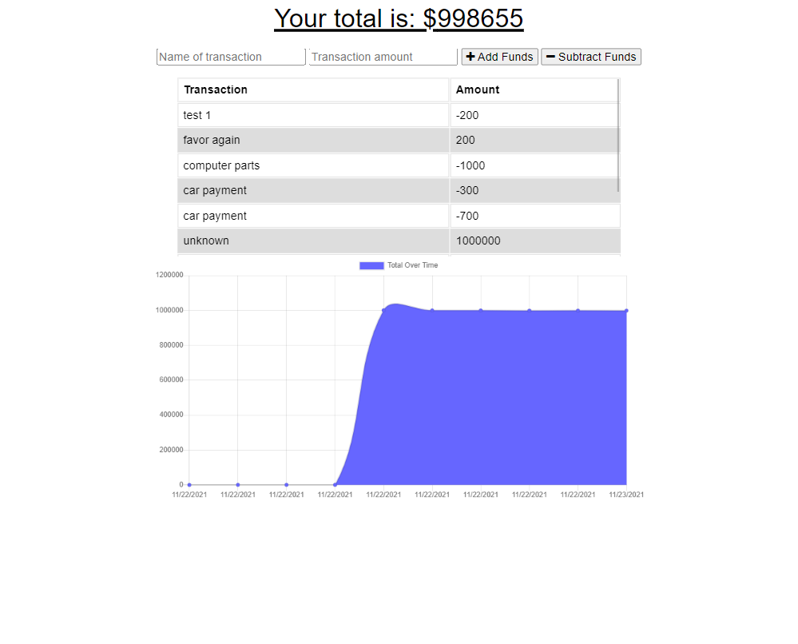

# Online Offline Budget Trackers

Adding functionality to an existing budget tracker app in order for it to operate in an offline status.

## Pseudo Code

* User will be able to add expenses and deposits to their budget with or without a connection
* When entering transactions offline, they should populate the total when brought back online
* Offline functionality:
  * Enter deposits offline
  * Enter expenses offline
* When brought back online:
  * Offline entries should be added to tracker.
* WANT to be able to track withdrawals and deposits with or without a data/internet connection
* SO THAT the account balance is accurate when traveling
* GIVEN a user is on Budget App without an internet connection
* WHEN user inputs a withdrawal or deposit
* THEN that will be shown on the page, and added to their transaction history when their connection is back online

## Screenshot

## Deployed Application

[Link to deployed heroku site](https://safe-beach-40448.herokuapp.com/)